# Agentic-Coding-Dev-Setup

## Introduction

> Video walkthrough (German): [YouTube](https://www.youtube.com/watch?v=A-Jo6zz8HUo)

This repository contains a complete developer setup for **agent-based coding with GitHub Copilot** in VS Code. It solves two problems:

1. **Automatically install and configure MCP servers** — a single script sets up all required MCP servers (Model Context Protocol) so Copilot can access Azure DevOps, databases, Microsoft Docs, and other services.
2. **Provide unified coding standards for the AI agent** — Instructions, Skills, Agents, and Prompts in the `.github/` folder control *how* Copilot generates code, reviews it, and tests it.

The result: You open VS Code, start the Copilot Chat in **Agent Mode**, and immediately have an agent that knows your project conventions, can access your ADO work items, and produces code according to your standards.

---

## Prerequisites

Before you run the setup, make sure the following tools are installed and available:

| Tool | Minimum Version | Check Command | Note |
|------|-----------------|---------------|------|
| **Node.js** | 20.0.0 | `node --version` | LTS version recommended |
| **npm** | (with Node.js) | `npm --version` | Required for `npx` |
| **VS Code** or **VS Code Insiders** | Current | — | Copilot Extension must be installed |
| **GitHub Copilot** | Current | — | License required (Individual, Business, or Enterprise) |
| **Docker Desktop** | Current | `docker info` | Only needed for Neo4j Knowledge Graph server |
| **Git** | Current | `git --version` | For symlinks and repo management |

### Environment Variables (Optional)

Some MCP servers require connection strings as environment variables. You can set these before starting VS Code:

| Variable | Purpose | Example |
|----------|---------|---------|
| `MDB_MCP_CONNECTION_STRING` | MongoDB connection for the MongoDB MCP server | `mongodb://localhost:27017` |
| `MSSQL_MCP_CONNECTION_STRING` | SQL Server connection for the MSSQL MCP server | `Server=localhost;Database=mydb;...` |

> **Tip:** Set variables permanently via Windows System Environment Variables or a `.env` file in your profile so they're available every time VS Code starts.

---

## Initial Setup

### Why a Setup Script?

GitHub Copilot in Agent Mode can access external tools and services via the **Model Context Protocol (MCP)**. Each MCP server must be registered in the VS Code configuration (`mcp.json`). Maintaining this manually is error-prone and time-consuming — especially when multiple servers with binaries, Docker containers, and NPX packages need to work together.

The setup script handles everything in a single pass:
- **Pre-load NPX packages** — so the first start of MCP servers is fast
- **Start Neo4j Docker container** — a local graph database for the Knowledge Graph MCP server
- **Download Neo4j-MCP binary** — platform-specific from GitHub Releases
- **Generate and merge `mcp.json`** — for VS Code *and* VS Code Insiders, without overwriting existing entries

### Running the Setup

```bash
# Clone the repository
git clone <repo-url> C:\Repos\Agentic-Coding-Dev-Setup
cd C:\Repos\Agentic-Coding-Dev-Setup

# Run once
npm run setup-mcp
```

The script automatically detects whether you're on Windows or macOS and adjusts paths and binaries accordingly.

### Options

| Command | Description |
|---------|-------------|
| `npm run setup-mcp` | Full setup (all MCP servers + Neo4j Docker + cache) |
| `npm run setup-mcp:dry-run` | Shows what would be done **without** making any changes |
| `npm run setup-mcp:quick` | Skips Neo4j (binary + Docker) and cache warming — for quick re-setup |

Individual steps can also be skipped:

```bash
node setup-mcp-servers.mjs --skip-neo4j          # No Neo4j binary download
node setup-mcp-servers.mjs --skip-neo4j-docker    # No Docker container
node setup-mcp-servers.mjs --skip-cache-warm      # No NPX cache warming
```

### What Gets Installed?

After setup, the following MCP servers are configured:

| # | Server | Type | Purpose |
|---|--------|------|----------|
| 1 | **azure-devops** | npx, stdio | Access Work Items, Repos, Pipelines, Wikis in Azure DevOps |
| 2 | **sequential-thinking** | npx, stdio | Structured thinking for complex problem-solving |
| 3 | **microsoft-learn** | HTTP (remote) | Search and retrieve official Microsoft documentation |
| 4 | **memory** | npx, stdio | Knowledge Graph for persistent agent memory |
| 5 | **mongodb** | npx, stdio | Direct access to MongoDB databases |
| 6 | **mssql** | npx, stdio | Direct access to SQL Server databases |
| 7 | **neo4j** | Binary, stdio | Graph database access to local Neo4j instance |

The configuration is written to these files:
- **VS Code:** `%APPDATA%\Code\User\mcp.json`
- **VS Code Insiders:** `%APPDATA%\Code - Insiders\User\mcp.json`

> **Important:** Restart VS Code after setup. When first opening Copilot Chat in Agent Mode, activate the desired MCP servers under **"Select Tools"**. The Azure DevOps server will ask for the organization name on first use.

### Setup for MonoRepos

In a MonoRepo setup (e.g., `Fusion-Backend/`), you want to use the `.github/` artifacts (Instructions, Skills, Agents, Prompts) **without copying them to each repository**. The solution: **Symbolic Links (Symlinks)**.

#### Why Symlinks?

- **Single Source of Truth** — Changes to Instructions or Skills are maintained centrally in this repository
- **No Duplicates** — no manual synchronization between repositories
- **Git-compatible** — Symlinks are tracked by Git (on Windows, Developer Mode must be active or Git configured with `core.symlinks=true`)

#### Creating Symlinks

Open an **administrative PowerShell** (or ensure Windows Developer Mode is active) and create the symlink in the target repository:

```powershell
# In the target repository (e.g., Fusion-Backend)
cd C:\Repos\Fusion-Backend

# Symlink for the entire .github folder
New-Item -ItemType SymbolicLink -Path ".github" -Target "C:\Repos\Agentic-Coding-Dev-Setup\.github"
```

If the target repository already has a `.github` folder (e.g., with workflows), link only the relevant subfolders:

```powershell
# Link only agent-specific folders
New-Item -ItemType SymbolicLink -Path ".github\instructions" -Target "C:\Repos\Agentic-Coding-Dev-Setup\.github\instructions"
New-Item -ItemType SymbolicLink -Path ".github\skills"       -Target "C:\Repos\Agentic-Coding-Dev-Setup\.github\skills"
New-Item -ItemType SymbolicLink -Path ".github\agents"       -Target "C:\Repos\Agentic-Coding-Dev-Setup\.github\agents"
New-Item -ItemType SymbolicLink -Path ".github\prompts"      -Target "C:\Repos\Agentic-Coding-Dev-Setup\.github\prompts"

# Optional: AGENTS.md in root
New-Item -ItemType SymbolicLink -Path ".github\AGENTS.md"    -Target "C:\Repos\Agentic-Coding-Dev-Setup\.github\AGENTS.md"
```

#### Verification

```powershell
# Verify symlink
Get-Item ".github\instructions" | Select-Object Name, LinkTarget
```

> **Note for Git on Windows:** Ensure `git config core.symlinks true` is set so symlinks are checked out correctly. Symlinks work without admin rights in Windows Developer Mode (Settings → For Developers).

---

## Working with the Agent

Once the setup is in place, it's time to do the actual work. This chapter explains how the AI configuration is structured and how to use it effectively.

### Architecture Overview

The following diagram shows how the components interact:

```mermaid
flowchart TB
    User["Developer (VS Code)"]
    Chat["Copilot Chat\n(Agent Mode)"]

    subgraph gh [".github/ — AI Configuration"]
        AGENTS["AGENTS.md\n(Main Agent)"]
        Instructions["instructions/\ngeneral · tests"]
        Agents["agents/\nC# · Debug · DevOps\nMongoDB · MSSQL\nAPI Stitching"]
        Skills["skills/\nbackend-developer\ncode-reviewer\ndatabase-specialist\ndevops-specialist\nservice-scaffolder\n..."]
        Prompts["prompts/\nImplement_from_PBI"]
    end

    subgraph mcp ["MCP Servers"]
        ADO["Azure DevOps"]
        Mongo["MongoDB"]
        MSSQL["SQL Server"]
        Neo4j["Neo4j\n(Knowledge Graph)"]
        MSLearn["Microsoft Learn"]
        Memory["Memory\n(Graph Memory)"]
        SeqThink["Sequential\nThinking"]
    end

    User --> Chat
    Chat --> AGENTS
    AGENTS --> Instructions
    AGENTS --> Agents
    AGENTS --> Skills
    Chat --> Prompts
    Chat --> mcp
```



### Structure

All AI-related artifacts are in the `.github/` folder and are automatically recognized by VS Code / Copilot:

```
.github/
├── AGENTS.md                      # Main agent definition (always loaded)
├── instructions/                  # Coding standards and conventions
│   ├── general.instructions.md    #   → Applies to all files (**)
│   └── tests.instructions.md      #   → Applies only to test files (**/test/**/*Tests.cs)
├── agents/                        # Specialized agents
│   ├── APIStitchingExpert.agent.md #   → Schema stitching, query delegation
│   ├── CSharpExpert.agent.md      #   → C#/.NET design, patterns, performance
│   ├── DebugExpert.agent.md       #   → Build errors, runtime exceptions
│   ├── DevOpsExpert.agent.md      #   → Pipelines, Docker, Kubernetes
│   ├── MongoDBExpert.agent.md     #   → Schema design, indexing, queries
│   └── MSSQLExpert.agent.md       #   → Stored procedures, execution plans
├── skills/                        # Domain-specific knowledge
│   ├── backend-developer/         #   → HotChocolate, MassTransit, MongoDB repos
│   ├── code-reviewer/             #   → Code review per SwissLife standards
│   ├── database-specialist/       #   → SyncHub pipeline implementation
│   ├── devops-specialist/         #   → F2C pipeline templates, Helm, K8s patterns
│   ├── service-scaffolder/        #   → Scaffold new microservices end-to-end
│   ├── prompt-creator/            #   → Write and optimize prompts
│   └── ...                        #   → other skills (docx, pdf, xlsx, pptx, ...)
└── prompts/                       # Reusable prompt workflows
    └── Implement_from_PBI.prompt.md  # → Implement feature end-to-end from ADO PBI
```

#### What is What?

| Artifact | Description | When Loaded? |
|----------|-------------|--------------|
| **AGENTS.md** | Defines the main agent: persona, trust boundary, non-negotiable patterns, workflow, and delegations to specialist agents | Always (on every chat) |
| **Instructions** | Coding standards that Copilot must follow when generating code (e.g., naming conventions, architecture rules, test patterns) | Automatically based on `applyTo` pattern |
| **Agents** | Specialist expert agents that the main agent delegates to as needed (e.g., C# questions → CSharpExpert) | By main agent as needed or directly via `@agent` |
| **Skills** | Deep domain knowledge with concrete code examples and patterns from the project. Skills are automatically loaded when Copilot detects they're relevant | Automatically on relevant context |
| **Prompts** | Predefined multi-step workflows for recurring tasks (e.g., feature implementation from PBI to PR) | Manually via prompt menu |

### Working with Prompts

Prompts are predefined workflows that you trigger through Copilot Chat. They provide a structured approach for complex tasks.

#### Using a Prompt

1. Open **Copilot Chat** in Agent Mode (the agent icon in the chat window)
2. Type `/` and select the desired prompt from the list
3. Follow the prompt's instructions — for example, it might ask for a PBI number

#### Example: Implement Feature from PBI

The `Implement_from_PBI` prompt guides you through the entire implementation process:

1. **Phase 0 — Identify PBI:** You provide the Work Item ID
2. **Phase 1 — Analysis:** The agent reads the PBI, parent, children, and linked items from Azure DevOps
3. **Phase 2 — Codebase Analysis:** The agent examines affected domain services and their patterns
4. **Phase 3 — Implementation Plan:** A step-by-step plan is created — you confirm it before code is written
5. **Phase 4 — Implementation:** Step by step, compilation and tests run after each step
6. **Phase 5 — Write Tests:** Unit tests per project conventions, target ≥82% coverage on new code
7. **Phase 6 — Code Review:** The `code-reviewer` skill checks changes against SwissLife standards

> **Important:** The agent waits for your explicit confirmation after Phase 3. You always stay in control of the plan before code is generated.

### Working Without Prompts

You don't need to use prompts to be productive. The agent is powerful in free chat mode too, because **Instructions and Skills are automatically loaded**.

#### Direct Dialog

Simply ask the agent questions or give instructions:

```
"Add a new property 'ExpirationDate' of type DateTimeOffset 
 to the Contract model and adapt all affected layers."
```

The agent will:
- Follow `general.instructions.md` (naming, architecture rules)
- Load the `backend-developer` skill (HotChocolate resolver pattern, MongoDB repository)
- Work step-by-step through the layers (Abstractions → Core → DataAccess → GraphQL)

#### Call Specialist Agents Directly

You can also address specialized agents directly:

```
"@CSharpExpert How should I best implement the Repository pattern here 
 with a generic base class?"
```

```
"@DebugExpert This MassTransit consumer throws a NullReferenceException. 
 Help me debug it."
```

```
"@MongoDBExpert Analyze the indexes on the contracts collection and 
 suggest improvements."
```

#### Use MCP Servers Directly

The MCP servers are automatically available to the agent. You can ask it to actively use them:

```
"Show me the open PBIs in the current sprint."

"Search Microsoft documentation for best practices 
 on HotChocolate DataLoader."

"What does the schema of the 'contracts' collection look like in the database?"

"Create an overview of the last 10 commits in the Fusion-Backend repo."
```

### Best Practices for Effective Work

#### 1. Provide Context

The more context you give, the better the result:

```
❌ "Add a field."
✅ "Add a property 'LastModifiedBy' (string, required) to the 
    ConsultationDocument model in the Consultation service. 
    It should be exposed in the GraphQL schema and set 
    in the repository on update."
```

#### 2. Work Incrementally

Break large changes into small steps:

```
Step 1: "Create the new model in Abstractions."
Step 2: "Implement the service in Core."
Step 3: "Add the repository in DataAccess."
Step 4: "Expose it via GraphQL."
Step 5: "Write the unit tests."
```

#### 3. Get Code Reviews

After larger changes:

```
"Review my current changes on this branch."
```

The `code-reviewer` skill is automatically loaded and checks against SwissLife standards.

#### 4. Validate Results

Trust but verify:
- **Does the code compile?** — The agent should run `dotnet build` after each step
- **Do the tests pass?** — Existing tests must not break
- **Is the architecture correct?** — No HotChocolate dependencies in the Core layer, no business logic in the API layer

---

## Customize Configuration

### Extend Instructions

Instructions in `.github/instructions/` are automatically loaded based on the `applyTo` pattern. To add new standards:

1. Create a new `.instructions.md` file
2. Define in the frontmatter which files it applies to:

```yaml
---
applyTo: "**/src/**/GraphQL/**/*.cs"
---
```

3. Write the rules as clear, imperative instructions

### Add Skills

A new skill consists of a folder under `.github/skills/` with a `SKILL.md` file:

```
.github/skills/my-new-skill/
└── SKILL.md
```

The `SKILL.md` contains:
- **Frontmatter** with name, description, and trigger keywords
- **Concrete domain knowledge** with code examples from the project
- **Dos and Don'ts** for the specific context

> **Tip:** Use the `skill-creator` skill to create new skills in a structured way: *"Create a new skill for [domain]."*

### Add Agents

New agents are stored as `.agent.md` files under `.github/agents/`. Each agent defines:
- **Persona and expertise** — which area they're expert in
- **Rules and conventions** — specific patterns they must follow
- **Workflow** — how they approach tasks

> **Tip:** Use the `agent-creator` skill to create new agents in a structured way: *"Create a new agent for [domain]."*

---

## Neo4j — Knowledge Graph Setup

### What is Neo4j?

Neo4j is an open-source **graph database** that stores data as nodes and relationships. Unlike relational databases, it's optimized for exploring connections between data points.

For your AI agent, Neo4j serves as a **persistent knowledge graph**. The agent can:
- Store connections between concepts, code patterns, and project entities
- Query relationships to find similar patterns or related functionality
- Build long-term memory about your project structure and conventions
- Surface relevant context when solving new problems

**Example:** The agent stores "Contract service uses MongoDB repositories" and "Consultation service also uses MongoDB repositories" — on the next task, it can immediately suggest the same pattern without re-discovering it.

### Why Not Just Use the Azure DevOps Connection?

Azure DevOps is great for work items and code history, but it doesn't persist:
- Learned patterns and conventions
- Relationships between concepts
- Contextual knowledge about architectural decisions
- Cross-cutting insights across multiple services

Neo4j keeps this knowledge alive across sessions.

### Setup

Neo4j is automatically set up during `npm run setup-mcp`:

1. **Docker container** (`neo4j-mcp-server`) starts with the Neo4j Community Edition
2. **Neo4j-MCP binary** is downloaded and configured
3. **Access credentials** are set: User `neo4j`, Password `neo4j-mcp-local`
4. **Persistent data volume** (`neo4j-mcp-data`) ensures data survives container restarts
5. **APOC plugin** is enabled for advanced graph operations

If you need to set it up manually:

```bash
npm run setup-mcp                    # Full setup
npm run setup-mcp:quick              # Skip Neo4j + cache
```

### Using the Neo4j Browser

Access the graph database visually:

**URL:** http://localhost:7474  
**User:** `neo4j`  
**Password:** `neo4j-mcp-local`

You can run Cypher queries to inspect the graph:

```cypher
// Find all nodes
MATCH (n) RETURN n LIMIT 25

// Find relationships between nodes
MATCH (a)-[r]->(b) RETURN a, r, b LIMIT 10

// Search for a specific concept
MATCH (n) WHERE n.name =~ '(?i).*mongodb.*' RETURN n
```

### Learning More About Neo4j

Watch the official Neo4j tutorial series:

📺 **[Neo4j Learning Playlist](https://www.youtube.com/playlist?list=PLriKR1xQz6aJAcpZaVeXB_Cy37uhIE-uz)**

This playlist covers:
- Graph databases basics
- Cypher query language
- Using APOC plugins
- Performance optimization

---

## Troubleshooting

### MCP servers don't start

1. **Restart VS Code** — MCP servers are initialized on startup
2. **Activate MCP servers** — In Copilot Chat under "Select Tools" check if servers are enabled
3. **Check logs** — `Ctrl+Shift+P` → "Output: Show Output Channel" → select "GitHub Copilot Chat"
4. **Check `mcp.json file`** — Open the file and ensure configuration is correct:
   ```
   %APPDATA%\Code\User\mcp.json
   ```

### Neo4j container not running

```powershell
# Check status
docker ps -a --filter name=neo4j-mcp-server

# Start container
docker start neo4j-mcp-server

# Check logs
docker logs neo4j-mcp-server
```

Neo4j Browser: http://localhost:7474 (User: `neo4j`, Password: `neo4j-mcp-local`)

### Azure DevOps server reports errors

- Make sure you're logged into GitHub **and** Azure DevOps in VS Code
- On first use, you'll be asked for the ADO organization name — provide it without URL prefix (e.g., `myorg`, not `https://dev.azure.com/myorg`)

### Run setup again

The script can be run again at any time. Existing `mcp.json` entries are merged, not overwritten:

```bash
npm run setup-mcp
```

---

## Conclusion

This setup gives you an AI coding agent that:

- **Knows your conventions** — through Instructions and Skills in the `.github/` folder
- **Can access your tools** — Azure DevOps, MongoDB, SQL Server, Neo4j, Microsoft Docs
- **Works in a structured way** — through predefined prompts for recurring workflows
- **Can specialize** — through agents for C#, debugging, DevOps, databases, API stitching

The key to effective work: **provide context, work incrementally, validate results.** The agent is a powerful tool — but you remain the architect.

---

## Smoke Test

After setup, verify everything works by asking these three questions in Copilot Chat (Agent Mode):

### 1. MCP Server Connectivity

```
Search Microsoft Learn for "HotChocolate DataLoader best practices".
```

Expected: The agent uses the `microsoft-learn` MCP server and returns documentation results.

### 2. Agent & Skill Loading

```
Review the coding standards that apply to test files in this project.
```

Expected: The agent references `tests.instructions.md` and summarizes the test conventions (xUnit, Moq, FluentAssertions, naming pattern `MethodName_Scenario_ExpectedBehavior`).

### 3. Sequential Thinking

```
Break down the steps needed to add a new "Notes" property (string, optional) 
to an existing entity in the Consultation service.
```

Expected: The agent uses sequential thinking to produce a layered plan (Abstractions → Core → DataAccess → GraphQL → Tests).

If all three produce meaningful results, your setup is working correctly.

